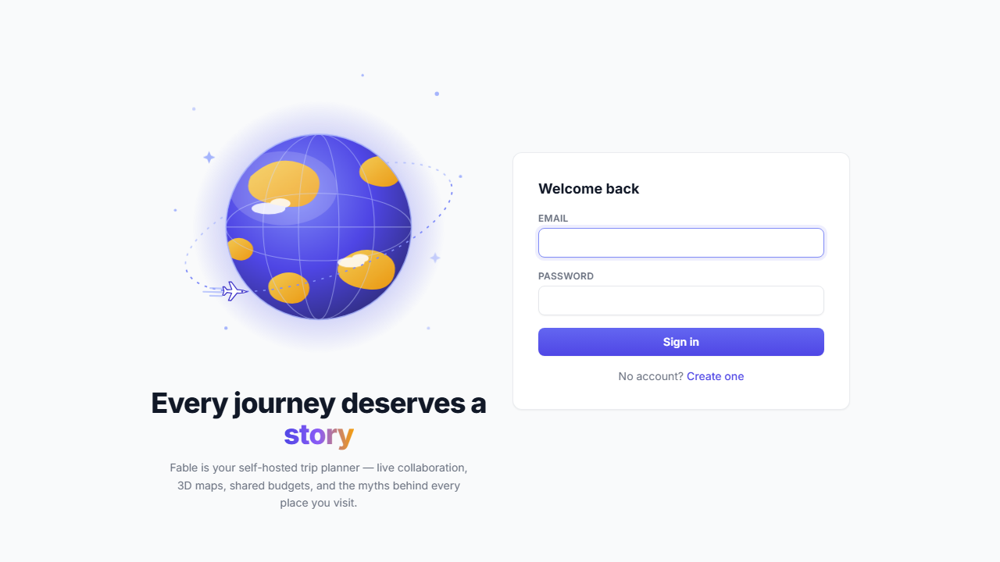
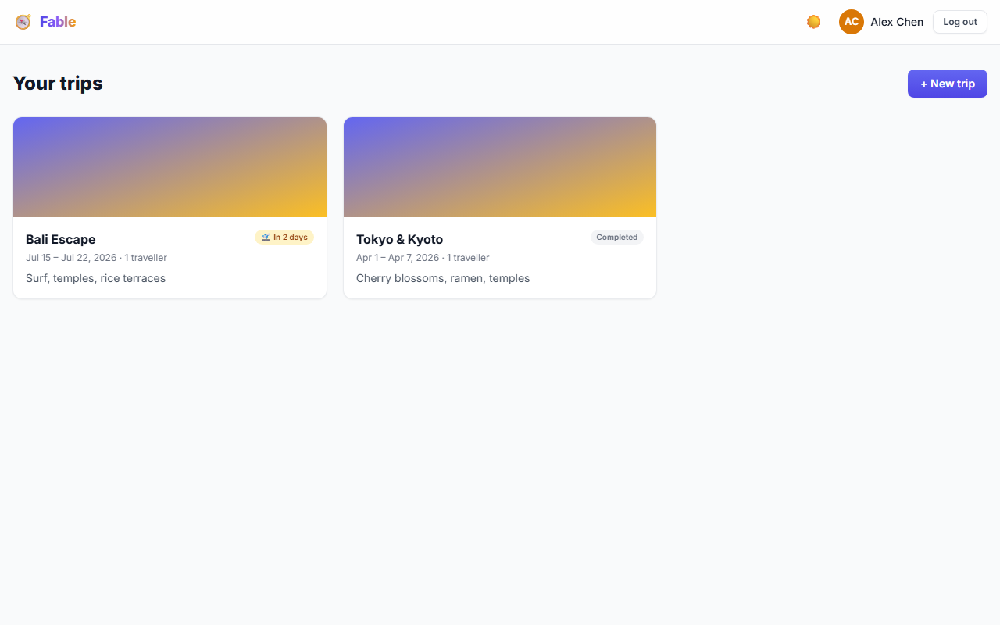
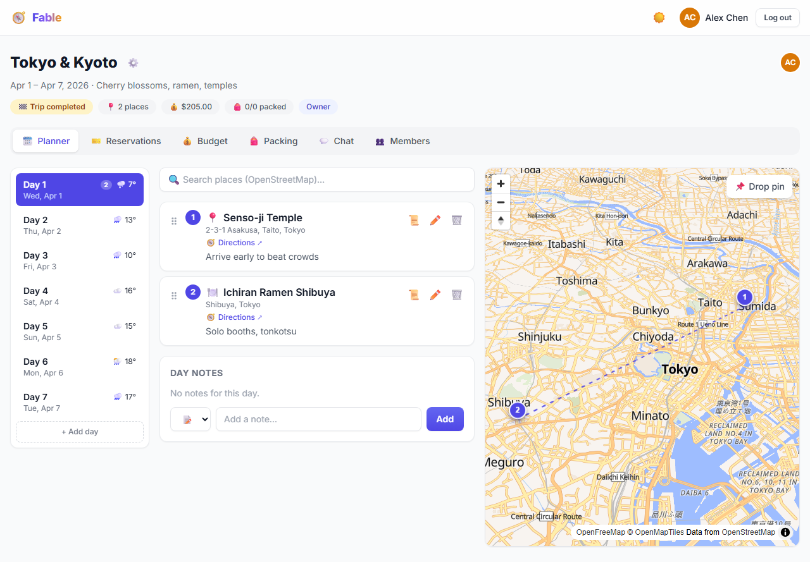
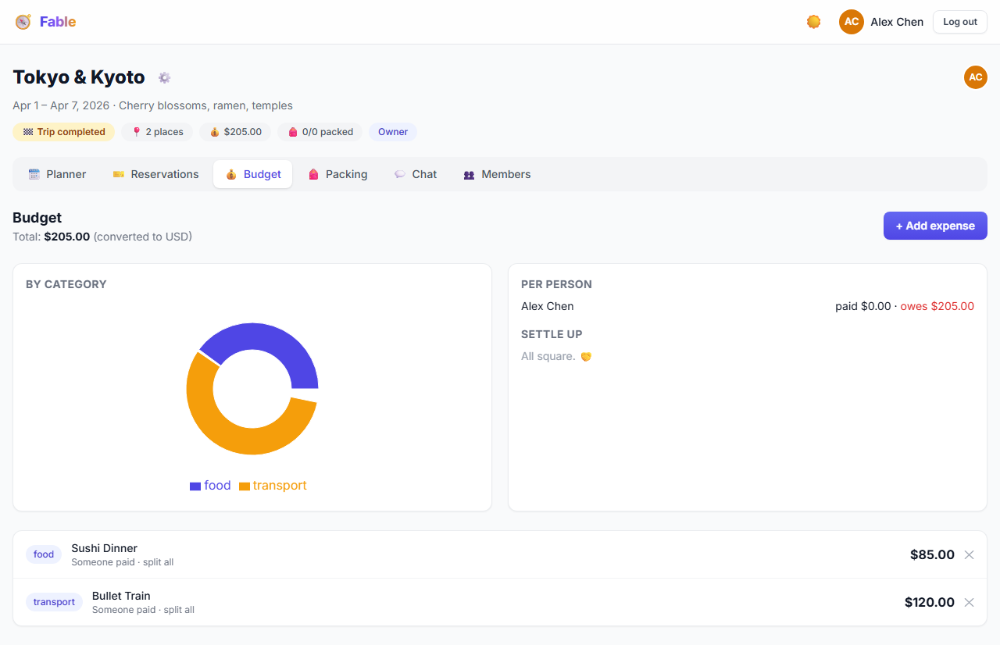

<p align="center">
  
  
  
  
  
  
  
  
  
  
</p>

# 🧭 Fable

## 📸 Screenshots

<table>
  <tr>
    <td></td>
    <td></td>
  </tr>
  <tr>
    <td align="center"><em>Landing — animated globe hero</em></td>
    <td align="center"><em>Dashboard — trip cards with countdown chips</em></td>
  </tr>
  <tr>
    <td></td>
    <td></td>
  </tr>
  <tr>
    <td align="center"><em>Planner — drag-and-drop days + live 3D map</em></td>
    <td align="center"><em>Budget — pie chart + minimal settle-up</em></td>
  </tr>
</table>

---

**A self-hosted, real-time collaborative travel planner** — plan trips with friends using shared itineraries, drag-and-drop day planning, live maps, auto-settling budgets, packing lists, trip chat, and **Lore** — a unique feature that surfaces the myths, legends, and fiction behind every place you visit.

> *No external paid APIs. No vendor lock-in. Your data never leaves your server.*

---

## ✨ Features

### 🗓️ Trip & Day Management
- Create trips with a date range; day-by-day itinerary auto-generates from your start/end dates
- Add, remove, or extend days independently — days with content are preserved even when resizing the date range
- Smart default: opens today's plan when the trip is currently in progress

### 📌 Drag-and-Drop Day Planner
- Built with **@dnd-kit** — reorder places within a day or drag them across days
- Optimistic UI updates with automatic rollback on failure
- Numbered place cards with category icons, ratings, hours, and notes

### 🗺️ Interactive Map
- **MapLibre GL** (OpenStreetMap tiles) with marker clustering and a numbered route polyline
- Bi-directional highlighting: click a card → map centers on the marker, click a marker → the card highlights
- Click anywhere on the map to drop a pin and add a new place (editors only)

### 🔍 Place Search
- **Nominatim** (OpenStreetMap) geocoding — no API key required
- Instant results with address, coordinates, and reverse-geocoded details
- One-click add to the currently selected day

### 🌦️ Weather Forecasts
- **Open-Meteo** 16-day forecast displayed per day card (temperature range + weather icon)
- Falls back to seasonal monthly averages for trips beyond the forecast horizon
- Anchors forecast on the first geocoded place in the trip

### 👥 Real-Time Collaboration
- Every mutation (place added, budget updated, message sent, etc.) broadcasts instantly over **WebSocket** to all connected trip members
- **Presence system**: see who's currently viewing the trip with live avatar indicators
- Typing indicators in trip chat
- On reconnect: automatic REST re-sync to catch any events missed while offline

### 🔐 Members & Role-Based Access Control
- Invite collaborators by email with granular roles: **Owner**, **Editor**, **Viewer**
- Viewers can browse but cannot mutate — enforced on both client and server
- Only the trip owner can delete a trip or manage member roles

### ✈️ Reservations
- Track flights, accommodations, dining, and transport with color-coded type badges
- Fields for confirmation numbers, date/time ranges, cost, notes, and file attachments
- Chronological timeline view sorted by start date

### 💰 Budget & Expense Splitting
- Multi-currency expense tracking with automatic USD normalization
- **Interactive pie chart** (Recharts) for spending by category
- Per-person paid/owed balances with a **minimal-transaction settle-up algorithm** — computes the fewest transfers to zero out all debts
- Configurable splitting: split among everyone or select specific members

### 🎒 Packing List
- Categorized items with quantities and assignees
- Real-time synced checkboxes with a progress bar
- Assign items to specific trip members

### 📜 Lore — Discover the Stories Behind Places
- Surfaces mythology, folklore, literary appearances, and historical context for any place
- Sourced from **Wikipedia** and cached server-side in SQLite for fast repeated lookups
- Includes article images, official website links, and structured facts by topic

### 💬 Trip Chat
- Real-time per-trip messaging over WebSocket
- Typing indicators and message history with user avatars
- Persisted server-side with full REST API for message retrieval

### 📱 Progressive Web App (PWA)
- Installable on mobile and desktop with offline shell caching
- Responsive design optimized for both phone and desktop viewports
- Dark mode with system preference detection and manual toggle

---

## 🏗️ Architecture

```
┌─────────────────────────────────────────────────────────────┐
│                       Client (React 18)                     │
│  ┌──────────┐  ┌──────────┐  ┌─────────┐  ┌─────────────┐  │
│  │  Zustand  │  │  Router  │  │ MapLibre│  │  Recharts   │  │
│  │  Stores   │  │  (RRD6) │  │   GL    │  │  (Charts)   │  │
│  └────┬──┬──┘  └──────────┘  └─────────┘  └─────────────┘  │
│       │  │                                                  │
│  REST │  │ WebSocket                                        │
└───────┼──┼──────────────────────────────────────────────────┘
        │  │
┌───────┼──┼──────────────────────────────────────────────────┐
│       │  │          Server (NestJS)                          │
│  ┌────▼──▼──┐  ┌──────────┐  ┌──────────┐  ┌────────────┐  │
│  │  Express │  │   JWT    │  │    WS    │  │  Multer    │  │
│  │  Router  │  │  Guards  │  │  Server  │  │  Uploads   │  │
│  └────┬─────┘  └────┬─────┘  └────┬─────┘  └────────────┘  │
│       │             │             │                          │
│  ┌────▼─────────────▼─────────────▼──────────────────────┐  │
│  │              better-sqlite3 (WAL mode)                │  │
│  │         Raw SQL + file-based migrations                │  │
│  └───────────────────────────────────────────────────────┘  │
└─────────────────────────────────────────────────────────────┘
```

### Tech Stack

| Layer       | Technology |
|-------------|-----------|
| **Runtime** | Node.js 20 |
| **Backend** | NestJS 10, better-sqlite3 (WAL mode), JWT (15min access + 30-day httpOnly refresh cookie with rotation), `ws` WebSocket server |
| **Frontend** | React 18, Vite 5, TypeScript 5, Zustand 4, Tailwind CSS 3, MapLibre GL, Recharts, @dnd-kit, date-fns |
| **Database** | SQLite (single file) with raw SQL migrations — zero external DB setup |
| **Auth** | bcrypt password hashing, JWT access/refresh token pair, single-flight token refresh, rate-limited login |
| **Realtime** | Native `ws` library — heartbeat pong, exponential backoff reconnect, room-based broadcasting |
| **Free APIs** | OpenStreetMap tiles, Nominatim geocoding, Open-Meteo weather, Wikipedia REST API |
| **DevOps** | Docker (multi-stage build), Docker Compose, health checks |

---

## 🚀 Getting Started

### Prerequisites

- **Node.js** ≥ 18
- **npm** ≥ 9 (ships with Node)

### Development

```bash
# Clone the repository
git clone https://github.com/shreyshringare/Fable.git
cd Fable

# Install all dependencies (npm workspaces)
npm install

# Terminal 1 — API server on :3000
npm run dev:server

# Terminal 2 — Vite dev server on :5173 (proxies /api, /uploads, /ws)
npm run dev:client
```

Open **http://localhost:5173** and register an account.

### Production (Docker)

```bash
# 1. Create your .env file
cp .env.example .env
# Edit .env and set a strong JWT_SECRET

# 2. Build and run
docker compose up -d --build
```

The app serves on **http://localhost:3000**. Data persists in `./data` (SQLite database) and `./uploads` (user-uploaded files).

### Manual Production Build

```bash
npm run build      # Compiles server (tsc) + client (vite)
npm start          # Runs node server/dist/main.js — serves API + SPA + uploads
```

---

## ⚙️ Environment Variables

| Variable | Default | Description |
|----------|---------|-------------|
| `PORT` | `3000` | HTTP + WebSocket listening port |
| `JWT_SECRET` | Dev fallback | Signing key for access/refresh tokens — **must be set in production** |
| `DATA_DIR` | `./data` | Directory for the SQLite database file |
| `UPLOAD_DIR` | `./uploads` | Directory for user-uploaded files (images, PDFs) |
| `ADMIN_EMAIL` | — | Seed an admin account on first boot |
| `ADMIN_PASSWORD` | — | Password for the seeded admin account |

---

## 📡 API Reference

**Base URL**: `/api/v1`

### Authentication
| Method | Endpoint | Description |
|--------|----------|-------------|
| `POST` | `/auth/register` | Create a new account |
| `POST` | `/auth/login` | Log in and receive JWT + refresh cookie |
| `POST` | `/auth/refresh` | Rotate refresh token and get a new access token |
| `POST` | `/auth/logout` | Revoke the refresh token |

### Trips
| Method | Endpoint | Description |
|--------|----------|-------------|
| `GET` | `/trips` | List all trips for the authenticated user |
| `POST` | `/trips` | Create a new trip (auto-generates day rows from date range) |
| `GET` | `/trips/:id` | Full trip detail: trip, members, days, places, notes |
| `PATCH` | `/trips/:id` | Update trip metadata (name, dates, cover image) |
| `DELETE` | `/trips/:id` | Delete a trip (owner only) |

### Members
| Method | Endpoint | Description |
|--------|----------|-------------|
| `POST` | `/trips/:id/members` | Invite a user by email with a role |
| `PATCH` | `/trips/:id/members/:userId` | Change a member's role |
| `DELETE` | `/trips/:id/members/:userId` | Remove a member |

### Days & Places
| Method | Endpoint | Description |
|--------|----------|-------------|
| `POST` | `/trips/:id/days` | Add a day |
| `DELETE` | `/trips/:id/days/:dayId` | Remove a day |
| `POST` | `/trips/:id/days/:dayId/places` | Add a place to a day |
| `PATCH` | `/trips/:id/days/:dayId/places/:placeId` | Update or move a place |
| `DELETE` | `/trips/:id/days/:dayId/places/:placeId` | Remove a place |
| `POST` | `/trips/:id/days/:dayId/places/reorder` | Batch reorder places |

### Day Notes
| Method | Endpoint | Description |
|--------|----------|-------------|
| `POST` | `/trips/:id/days/:dayId/notes` | Add a note to a day |
| `PATCH` | `/trips/:id/days/:dayId/notes/:noteId` | Update a note |
| `DELETE` | `/trips/:id/days/:dayId/notes/:noteId` | Remove a note |

### Reservations, Budget & Packing
| Method | Endpoint | Description |
|--------|----------|-------------|
| `GET/POST/PATCH/DELETE` | `/trips/:id/reservations[/:itemId]` | CRUD for reservations |
| `GET/POST/PATCH/DELETE` | `/trips/:id/budget[/:itemId]` | CRUD for budget items |
| `GET/POST/PATCH/DELETE` | `/trips/:id/packing[/:itemId]` | CRUD for packing items |

### Other
| Method | Endpoint | Description |
|--------|----------|-------------|
| `GET` | `/trips/:id/messages` | Retrieve chat history |
| `POST` | `/uploads/:kind` | Upload a file (kinds: `covers`, `places`, `reservations`, `avatars`) |
| `GET` | `/lore?q=...` | Fetch lore (mythology, history, fiction) for a place name |
| `GET` | `/health` | Health check endpoint |

### WebSocket Events

Connect to `/ws?token=<accessToken>` and send/receive JSON frames:

| Direction | Event | Description |
|-----------|-------|-------------|
| → Server | `JOIN_TRIP` | Subscribe to a trip room |
| → Server | `LEAVE_TRIP` | Unsubscribe from a trip room |
| → Server | `SEND_MESSAGE` | Send a chat message |
| → Server | `TYPING` | Broadcast typing indicator |
| ← Client | `PRESENCE` | Current list of online users in the room |
| ← Client | `PLACE_ADDED/UPDATED/DELETED/MOVED` | Place mutations |
| ← Client | `BUDGET_UPDATED` | Budget item added/updated/deleted |
| ← Client | `PACKING_UPDATED` | Packing item changes |
| ← Client | `RESERVATION_UPDATED` | Reservation changes |
| ← Client | `MESSAGE_SENT` | New chat message |
| ← Client | `TRIP_UPDATED/DELETED` | Trip-level changes |
| ← Client | `MEMBERS_UPDATED` | Member list changed |
| ← Client | `TYPING` | Someone is typing |

---

## 🗄️ Database Schema

SQLite with 10 tables, managed via sequential raw SQL migrations:

```
users ──────────┐
                ├── trip_members ──── trips
refresh_tokens ─┘                      │
                                       ├── days ──── places
                                       │        └── day_notes
                                       ├── reservations
                                       ├── budget_items
                                       ├── packing_items
                                       └── messages
```

Additional table: `lore_cache` for caching Wikipedia-sourced lore results.

---

## 🔒 Security

- **Password hashing** — bcrypt with 10 salt rounds
- **JWT access tokens** — 15-minute expiry, never stored in localStorage
- **Refresh token rotation** — 30-day httpOnly cookies; old tokens are revoked on each refresh
- **Single-flight refresh** — concurrent 401s share one refresh call to prevent token rotation race conditions
- **Rate limiting** — login endpoint is rate-limited to prevent brute force
- **Input validation** — NestJS `ValidationPipe` with whitelist mode strips unknown fields
- **RBAC** — every mutation endpoint checks role membership (owner/editor/viewer) before execution
- **Helmet** — HTTP security headers in production
- **WebSocket auth** — connections require a valid JWT; invalid tokens receive `4001` close code

---

## 🧩 Technical Highlights

| Area | Implementation Detail |
|------|----------------------|
| **State Management** | Zustand stores with optimistic updates — drag-and-drop reorders apply instantly and rollback on API failure |
| **Real-time Sync** | Room-based WebSocket broadcasting; clients apply incoming events as patches to the Zustand store and perform a full REST re-sync on reconnect |
| **Token Lifecycle** | Single-flight refresh pattern prevents race conditions when multiple concurrent requests receive 401s |
| **Budget Settling** | Minimal-transaction settle-up algorithm that computes the fewest number of transfers to zero out all balances |
| **Offline Resilience** | Service worker caches the app shell (via `vite-plugin-pwa`); WS reconnects with exponential backoff (max 15s) and re-syncs missed events via REST |
| **Database** | better-sqlite3 in WAL mode for concurrent reads; file-based migrations run automatically on startup |
| **Map** | MapLibre GL with marker clustering, numbered polyline routes, and click-to-add-place on the map canvas |
| **Weather** | Combines Open-Meteo's 16-day forecast API with seasonal monthly averages for far-future trips |
| **Zero Cost** | All external APIs (OpenStreetMap, Nominatim, Open-Meteo, Wikipedia) are free and keyless |

---

## 📁 Project Structure

```
fable/
├── client/                     # React SPA (Vite + TypeScript)
│   ├── src/
│   │   ├── components/         # 20 UI components (BudgetTab, MapView, PlannerTab, etc.)
│   │   ├── lib/                # API client, WebSocket singleton, weather, currency utils
│   │   ├── pages/              # Route-level pages (Dashboard, Login, Register, Trip, Profile)
│   │   ├── store/              # Zustand stores (auth, trip, toast)
│   │   ├── types.ts            # Shared TypeScript interfaces
│   │   └── App.tsx             # Router, auth guards, session restore
│   └── package.json
│
├── server/                     # NestJS API + WebSocket server
│   ├── src/
│   │   ├── auth/               # JWT auth, bcrypt, refresh rotation, rate limiting
│   │   ├── db/                 # SQLite connection, migration runner
│   │   ├── trips/              # 10+ controllers for trips, days, places, budget, packing, etc.
│   │   ├── uploads/            # Multer file upload handling
│   │   ├── lore/               # Wikipedia-powered lore engine with SQLite caching
│   │   ├── ws/                 # WebSocket server: rooms, presence, heartbeat, chat
│   │   └── main.ts             # Bootstrap: NestJS + WS attach
│   ├── migrations/             # Raw SQL migration files (auto-applied on startup)
│   └── package.json
│
├── Dockerfile                  # Multi-stage build (build + slim runtime)
├── docker-compose.yml          # One-command production deployment
└── package.json                # npm workspaces root
```

---

## License

MIT
